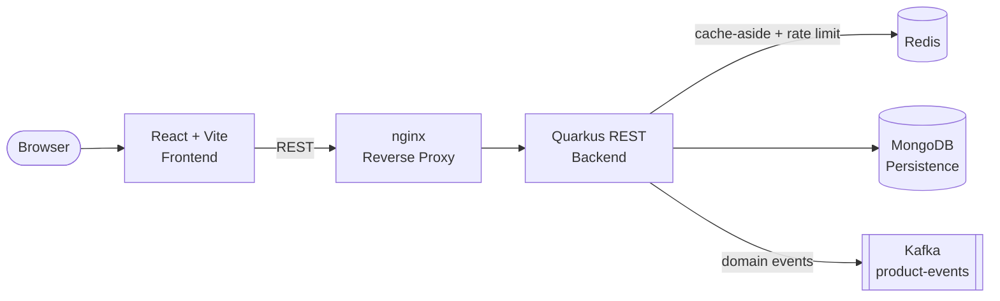

[](https://github.com/apchavez/quarkus-react/actions/workflows/ci.yml)
[](https://sonarcloud.io/summary/new_code?id=apchavez_quarkus-react)
[](https://sonarcloud.io/summary/new_code?id=apchavez_quarkus-react)
[](https://sonarcloud.io/summary/new_code?id=apchavez_quarkus-react)

# Product Management Platform

Fullstack application for product administration built as a portfolio project to demonstrate end-to-end development: Java 21 REST API with hexagonal architecture, React frontend, and a complete Kubernetes deployment.

---

## Tech Stack

| Layer | Technology |
|---|---|
| Backend | Java 21 · Quarkus 3 · MongoDB · Redis (cache + rate limiting) · Kafka (SmallRye Reactive Messaging) · MapStruct · Lombok · Testcontainers |
| Frontend | React 18 · TypeScript · Vite · Material UI |
| Infrastructure | Docker · Kubernetes · GitHub Actions |

---

## Architecture



The backend follows **Hexagonal Architecture (Ports & Adapters)**:

- **Domain layer** — Product entity, domain events (`ProductEvent`/`ProductEventType`), and port contracts (repository/event-publisher interfaces)
- **Application layer** — Use cases for CRUD operations, publishing a domain event after each create/update/delete
- **Infrastructure layer** — MongoDB adapter, Redis cache adapter + rate-limiting filter, Kafka event publisher, REST controller

The frontend is a single-page application built with React + Vite, communicating with the backend through a REST API.

Both services are independently containerized and orchestrated via Kubernetes or Docker Compose.

---

## Repository Structure

```text
product-management/
├── api/         Java + Quarkus backend
│   ├── src/
│   ├── Dockerfile
│   └── build.gradle
├── web/         React + Vite frontend
│   ├── src/
│   ├── Dockerfile
│   └── nginx.conf
├── chart/                           Helm chart — the manifests actually deployed (deploy.yml)
│   ├── Chart.yaml, values.yaml
│   └── templates/                  Deployments, services, ingress, mongo, redis, kafka, issuer,
│                                    PrometheusRule, Grafana, NetworkPolicy, PDB
├── terraform/                       EKS cluster + VPC the chart above deploys onto — see terraform/README.md
├── docker/
│   ├── gateway.conf                 nginx gateway (Docker Compose)
│   ├── kafka-client.properties      SASL client config for the Kafka healthcheck (Docker Compose)
│   ├── prometheus.yml               Prometheus scrape config (Docker Compose)
│   └── grafana/                     Datasource + dashboard provisioning (Docker Compose)
├── postman/
│   ├── quarkus-react.postman_collection.json
│   ├── quarkus-react.local.postman_environment.json
│   └── quarkus-react.k8s.postman_environment.json
├── .github/workflows/
│   ├── docker-publish.yml          Backend CI/CD
│   └── docker-publish-web.yml      Frontend CI/CD
├── docker-compose.yml
└── README.md
```

---

## Getting Started

### Docker Compose (recommended for local dev)

```bash
docker compose up --build
```

- App (frontend + API, via the `gateway` reverse proxy): `http://localhost`
- Prometheus: `http://localhost:9090`
- Grafana: `http://localhost:3000` (anonymous viewer access, pre-provisioned with the Product API dashboard)

### Kubernetes

```bash
helm upgrade --install product-management ./chart --namespace product-management --create-namespace
```

Add `product.local` to `/etc/hosts` pointing to your Ingress controller IP, then access the app at `http://product.local`.

Assumes a cluster with `ingress-nginx`, `cert-manager`, and an EBS-backed default `StorageClass` already exists. No such cluster is provisioned by default — see [`terraform/README.md`](terraform/README.md) to stand one up on EKS (note: this creates real, billed AWS resources).

---

## Testing

```bash
# Backend
cd api
./gradlew test

# Frontend unit tests
cd web
pnpm test

# Frontend E2E tests (Playwright)
cd web
pnpm test:e2e
```

Both services have independent test suites. The backend covers use cases, persistence adapters, and REST endpoints. Integration tests use **Testcontainers** with a real MongoDB 7.0 instance — Docker is required to run them.

See [`api/README.md`](api/README.md) for full coverage details and test descriptions.

**Frontend E2E (Playwright):** `web/e2e/products.spec.ts` covers page load, create, edit, delete, and form validation flows. All API calls are mocked with `page.route()` — no backend required to run the tests.

---

## CI/CD

GitHub Actions runs tests, publishes Docker images to GHCR, and deploys to Kubernetes:

| Workflow | Trigger | What it does |
|---|---|---|
| `ci.yml` | Every push / PR to `main` | Backend tests + JaCoCo coverage gate; frontend typecheck, tests, and coverage; Playwright E2E; Terraform fmt/validate; SonarCloud (on main) |
| `docker-publish.yml` | Push / PR to `main` (`api/**`) | Backend tests + coverage → builds and pushes `ghcr.io/apchavez/product-api:latest` and `:sha-<SHA>` |
| `docker-publish-web.yml` | Push / PR to `main` (`web/**`) | Frontend typecheck, tests, coverage → builds and pushes `ghcr.io/apchavez/product-web:latest` and `:sha-<SHA>` |
| `deploy.yml` | Manual (`workflow_dispatch`) | `helm upgrade --install product-management ./chart --set api.image.tag=latest --set web.image.tag=latest` → verifies rollout of `product-api` and `product-web` |

### Deploy flow

`deploy.yml` is manual-only — there's no live cluster behind this portfolio project, so triggering it automatically after every docker-publish would just fail on missing `KUBECONFIG`/secrets. Deploy explicitly when you have a real cluster to target:

```bash
gh workflow run deploy.yml
```

**Required secret:** `KUBECONFIG` — kubeconfig file content, configured in the `production` GitHub environment.

---

## Observability

| Signal | Endpoint | Notes |
|---|---|---|
| Metrics | `/api/v1/q/metrics` | Micrometer + Prometheus format |
| Health (liveness) | `/api/v1/q/health/live` | SmallRye Health |
| Health (readiness) | `/api/v1/q/health/ready` | Pings MongoDB with 2s timeout |
| Cache | `product-cache`, `products-search-cache` (Redis, 5 min TTL) | Cache-aside; invalidated on writes; fails open if Redis is unreachable |
| Traces | OTLP gRPC `$OTEL_EXPORTER_OTLP_ENDPOINT` | OpenTelemetry auto-instrumentation |
| Logs | stdout | JSON (ECS-like) in `prod` profile via `quarkus-logging-json`; human-readable in `dev` |

### Structured JSON logging

In the `prod` profile, logs are emitted as structured JSON to stdout — ready for Loki, Fluentd, or any log aggregator running as a sidecar in Kubernetes.

```json
{
  "timestamp": "2024-06-30T10:15:30.123Z",
  "level": "INFO",
  "loggerName": "com.products.adapters.in.rest.ProductResource",
  "message": "Creating product with SKU PROD-001",
  "mdc": {
    "traceId": "4bf92f3577b34da6a3ce929d0e0e4736",
    "spanId": "00f067aa0ba902b7"
  },
  "threadName": "executor-thread-1"
}
```

`traceId` and `spanId` are injected automatically into MDC by the `quarkus-opentelemetry` extension. In `dev` mode, the standard human-readable console format is used.

### Alerting

`chart/templates/prometheus-rule.yaml` defines a `PrometheusRule` (requires [Prometheus Operator](https://prometheus-operator.dev)) with three rules:

| Alert | Condition | Severity |
|---|---|---|
| `HighErrorRate` | >5% of requests return 5xx for 2 min | critical |
| `HighP99Latency` | P99 latency >1s for 2 min | warning |
| `PodNotReady` | Any pod not ready for 2 min | critical |

### Grafana

`chart/templates/grafana.yaml` deploys Grafana 11.1 with a pre-provisioned Prometheus datasource and a dashboard covering request rate, error rate, P50/P99 latency, and JVM memory. Access it locally with:

```bash
kubectl port-forward svc/grafana 3000:3000
```

Then open `http://localhost:3000` (anonymous viewer access, no login required).

The same Prometheus + Grafana pair is also available without a cluster via `docker compose up --build` (see [Getting Started](#getting-started)) — `docker/prometheus.yml` and `docker/grafana/` mirror the Helm chart's scrape config, datasource, and dashboard for local iteration.

---

## Postman

The `postman/` folder contains the collection and two environments.

| File | Description |
|---|---|
| `quarkus-react.postman_collection.json` | Main collection (12 requests) |
| `quarkus-react.local.postman_environment.json` | Local environment via Docker Compose |
| `quarkus-react.k8s.postman_environment.json` | Kubernetes environment (`product.local`) |

Import all three files into Postman, select the appropriate environment, and run the requests in order — `00 - Login` captures a JWT automatically and applies it as the collection's Bearer auth for every subsequent request; `01 - Create Product` captures `productId` for later requests. Health/metrics endpoints (`08`-`11`) are marked `noauth` since they don't require a token.

> For K8s: add `product.local` to `/etc/hosts` pointing to the Ingress controller IP before running the collection.

---

## OpenAPI

Documentation is auto-generated at startup from MicroProfile OpenAPI annotations (`quarkus-smallrye-openapi` extension).

| Endpoint | URL | Notes |
|---|---|---|
| Swagger UI | `http://localhost:8080/api/v1/q/swagger-ui` | Dev mode only |
| OpenAPI spec | `http://localhost:8080/api/v1/q/openapi` | Always available |

The Swagger UI is enabled in dev mode only (`%dev.quarkus.swagger-ui.enable=true`). To test protected endpoints from the UI, click **Authorize** and enter `Bearer <token>`. All endpoints require the `BearerAuth` scheme. Roles: `ADMIN` (write access), `USER` (read-only).

**Getting a token:** `POST /api/v1/auth/login` with `{"username": "...", "password": "..."}` returns a signed JWT. Demo users: `admin`/`admin123` (ADMIN + USER) and `user`/`user123` (USER only) — see `DemoUserStore.java`. The React frontend (`web/`) has a login page at `/login` that calls this endpoint, stores the token, and attaches it as a Bearer header to every API request; it redirects to `/login` automatically on a 401.

**Signing key:** no RSA keypair is committed to the repo. `EphemeralJwtKeyConfigSource` (`api/src/main/java/com/products/infrastructure/auth/`) generates a fresh RSA-2048 keypair in memory on startup and exposes it as `smallrye.jwt.sign.key`/`mp.jwt.verify.publickey` — used automatically for local dev, tests, and CI, with no setup needed. It's only a fallback (low config ordinal): if `SMALLRYE_JWT_SIGN_KEY`/`MP_JWT_VERIFY_PUBLICKEY` are set some other way, those win. On a real Helm deploy, `chart/templates/jwt-keys-job.yaml` (a `pre-install,pre-upgrade` hook Job) generates a keypair once and stores it in a `jwt-keys` Secret if one doesn't already exist, so all API replicas share the same key — a per-pod ephemeral key would break token verification across replicas.

**Start in dev mode:**

```bash
cd api
./gradlew quarkusDev
# Swagger UI → http://localhost:8080/api/v1/q/swagger-ui
```

---

## What This Project Demonstrates

- Fullstack development: Java backend + React frontend as independent services
- Hexagonal architecture on Quarkus with MongoDB persistence and a real Redis cache-aside layer (shared across replicas, fail-open on Redis outages)
- Domain events published to Kafka (`product-events`) after every create/update/delete, fire-and-forget via SmallRye Reactive Messaging — mirrors the event-driven pattern used in the [spring-angular](https://github.com/apchavez/spring-angular) sibling project
- Redis-backed fixed-window rate limiting (100 req/60s per IP) on mutating product endpoints, fail-open on Redis outages
- Complete Kubernetes manifests: ConfigMap, Secret, Deployments, Services, Ingress
- Multi-stage Docker builds for both backend and frontend
- Independent CI/CD pipelines per service (backend and frontend published separately to GHCR)
- Full observability stack: Prometheus metrics, OpenTelemetry tracing, SmallRye health checks, PrometheusRule alerts, and Grafana dashboard
- Infrastructure as Code: Terraform provisions the EKS cluster, VPC, EBS CSI driver, ingress-nginx, and cert-manager the Helm chart deploys onto (see [`terraform/README.md`](terraform/README.md))

---

## Detailed Documentation

See [`api/README.md`](api/README.md) for complete backend setup, endpoints, and deployment instructions.

---

## Related Projects

This repo pairs with **spring-angular** and **net-vue**: all three implement the same Product Management domain (sku/name/description/category/price/stock/active), same 7 REST endpoints, same Kafka `product-events` topic and Redis rate-limiting rules, different backend/frontend stack — kept in functional parity on purpose. The clinic-scheduling serverless trio forms a second such group, sharing that domain instead.

| Project | Description |
|---|---|
| [spring-angular](https://github.com/apchavez/spring-angular) | Same Product Management domain as this repo, reactive Spring Boot WebFlux backend, Angular frontend, PostgreSQL, Redis, Kafka, Kubernetes deployment |
| [net-vue](https://github.com/apchavez/net-vue) | Same Product Management domain as this repo, ASP.NET Core backend, Vue 3 frontend, PostgreSQL, Kafka, Kubernetes |
| [aws-typescript](https://github.com/apchavez/aws-typescript) | Clinic Scheduling Platform — TypeScript, AWS Lambda, DynamoDB, SNS/SQS |
| [azure-python](https://github.com/apchavez/azure-python) | Same clinic-scheduling domain as above, rewritten in Python on Azure Functions with Clean Architecture |
| [gcp-go](https://github.com/apchavez/gcp-go) | Same clinic-scheduling domain as above, written in Go on GCP Cloud Run with Clean Architecture |
---

## License

[MIT](LICENSE)
